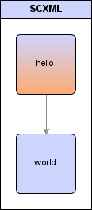
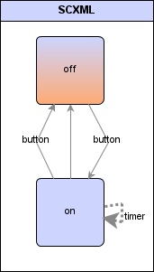
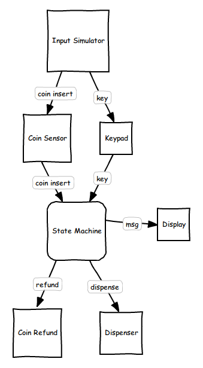
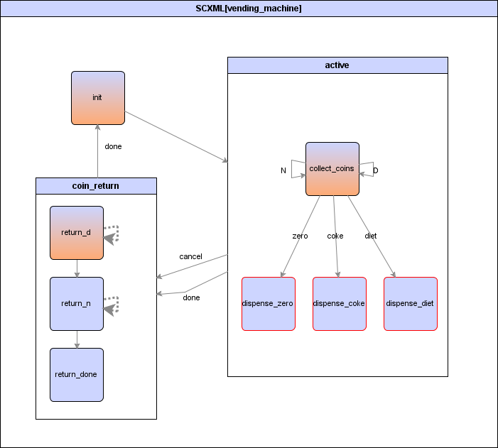

[Home](https://github.com/jp-embedded/scxmlcc) | [Documentation](index.md) | [Latest Release](https://github.com/jp-embedded/scxmlcc/releases) | [scxmlgui](https://github.com/fmorbini/scxmlgui/)
# Getting started
## Prerequisites
To build scxmlcc, you will need:
 * The boost library
 * Basic build tools

To build the test suite, you will also need:
 * xsltproc

Note that on windows, there is currently no automated way to build the test suite.

### On Ubuntu
Install the prerequisites with e.g. apt-get:
```
sudo apt-get install build-essential libboost-all-dev cmake autorevision xsltproc
```
autorevision is used to update the scxmlcc revision. This can be omitted.

xsltproc is used to build the unit tests. This can also be omitted.

So if you plan to just use scxmlcc as is for building your state machines, you can ommit autorevision and xsltproc.

### On Windows

You need to download and compile the boost library. If you already have boost installed, you can also use this.

Download [boost_1_62_0](https://sourceforge.net/projects/boost/files/boost/1.62.0/) and put it under `scxmlcc/src/boost_1_62_0` (after you have obtained scxmlcc, see below). You can use another version, use another path or use an existing boost installation. But then you must update the boost include and linker path in the scxml project properties in the visual studio solution, under `Configuration Properties > C/C++ > General > Additional Include Directories` and `Configuration Properties > Linker > Additional Library Directories`.

To build the boost library open a cmd prompt at the directory where boost was unzipped. Then execute the folowing two commands:
```
bootstrap
.\b2
```
If you want to build the unit tests, you must download [msxsl.exe](http://download.microsoft.com/download/f/2/6/f263ac46-1fe9-4ae9-8fd3-21102100ebf5/msxsl.exe) from microsoft and put it in your path.

## Obtaining And Building scxmlcc
scxmlcc is available as compressed releases or through github. The latest and previous releases is available at [Releases](https://github.com/jp-embedded/scxmlcc/releases).

### On Ubuntu
#### with make
```
cd src
make
```
If you also want to build the examples:
```
cd examples
make
```
#### with cmake 
```
git submodule update --init
mkdir build
cd build
cmake ..
make -j4
make install
```
If you're not familar with cmake have a look at the supported generators for visual studio, eclipse etc- https://cmake.org/cmake/help/latest/manual/cmake-generators.7.html.

To help with auto-generating state-machines in cmake projects, an scxml_generator.cmake module is installed.  The examples demonstrate how this can be used. 

### On Windows
The solution file `scxmlcc\src\vc2013\vc2013.sln` contain projects to build the scxml compiler and examples. This is for visual studio 2013.

## The Examples
This sections describes the examples which can be found at src/examples.
### Hello World
This is really not a practical state machine. It is just a simple expample for getting started with scxmlcc. This statechart is drawn in [scxmlgui](https://github.com/fmorbini/scxmlgui/), just two states connected with an unconditional transition. 



scxmlgui stores this as the following scxml:

```
<scxml initial="hello" version="0.9" xmlns="http://www.w3.org/2005/07/scxml">
 <state id="hello">
  <transition target="world"></transition>
 </state>
 <state id="world"></state>
</scxml>
```

This statechart can be compiled to an .h file using scxmlcc:
```
scxmlcc -o hello_world.h hello_world.scxml
```

This will generate hello_world.h which contains a sc_hello_world class implementing the statechart. 

Custom actions can be added to this statechart in C++ by specializing members in the sc_hello_world class. For example, consider the hello_world.cpp example which specializes the enter action on both states and instantiates the state machine:
```
#include "hello_world.h"
#include <iostream>

using namespace std;

typedef sc_hello_world sc;

template<> void sc::state_actions<sc::state_hello>::enter(sc::data_model &m)
{
	cout << "hello" << endl;	
}

template<> void sc::state_actions<sc::state_world>::enter(sc::data_model &m)
{
	cout << "world" << endl;	
}

int main(int argc, char *argv[])
{
	sc sc0;
	sc.init();
	return 0;
}
```
As expected, this will output the hello world words:
```
hello
world
```
The init method initializes the state machine and makes it enter its initial state.

Note that, as stated on the [home](https://github.com/jp-embedded/scxmlcc) page, no external libraries is nedded, and zero code is generated for the non specialized actions making it an efficient implementation.
### Timer Switch
This example implements a simple timer switch:



The idea is that the switch can be turned on or off by sending a button event to the state machine. In the on state the state machine also returns to the off state after a timeout. 
In the on state, a timer event counts up a timer value. The unconditional event from on to off then have a condition, so it will be executed when this timer value is >= 5. Finaly, the off state will reset the timer value to 0.

The dotted timer transition means that it is a transition without target. This means that the on state's enter/exit actions won't be executed on timer events, as opposed to if the transition had target.

These actions implement this in timer_switch.cpp as:
```
template<> void sc::state_actions<sc::state_on>::enter(sc::data_model &m)
{
	cout << "on" << endl;	
}

template<> void sc::state_actions<sc::state_off>::enter(sc::data_model &m)
{
	cout << "off" << endl;	
	m.user->timer = 0;
}

template<> bool sc::transition_actions<&sc::state::unconditional, sc::state_on, sc::state_off>::condition(sc::data_model &m)
{
	return m.user->timer >= 5;
}

template<> void sc::transition_actions<&sc::state::event_timer, sc::state_on>::enter(sc::data_model &m)
{
	++m.user->timer;
}
```

For this to work, a data model must be defined containing the timer variable. The generated state machine class has a user_model struct forward declaration, so a custom data model can be defined. This is done by defining user_model:
```
struct sc::user_model 
{
	int timer;
};
```

The custom data model can be constructed and passed to the state machine's constructor as:
```
sc::user_model m;
sc sc(&m);
sc.init();
```

For the full example source, see timer_switch.cpp.
### Vending machine
This example brings a bit more realistic example, where diffrent components need to interact with a state machine.The example implemets a simplified vending machine which can dispense three types of coke, after the customer has inserted currency into the machine. Below is a drawing of the diffrent components:



 * The 'State Machine' is responsible for the logic. This is described later.
 * The 'Coin Sensor' is responsible for detecting coin inserts.
 * The 'Keypad' is responsible for detecting key presses.
 * The 'Display' is responsible for displaying text messages.
 * The 'Coin refund' is responsible for refunding coins to the user.
 * The 'Dispenser' is responsible for dispensing the three coke types to the user.
 * The 'Input simulator' is reading input from your PC's keyboard and trigger the coin sensor and the keypad, so the system can be simulated.

The input simulator is added so we can simulate the vending machine, since we don't have a real coin sensor and keypad. Also since this example is only for simulating, the component implementations are really small and does not imlpement any real hardware support. But the machine are split into these components anyway to make the example a bit more realistic.

The communication between the componets is made with a signaling mechanism, which is a way of decoubling dependencies between components. So the individual components does not know of each other.

The state machine is implemented as follows:


After initialization, the state machine will enter the 'collect_coins' state, waiting for coins. When coins are inserted, a 'credit' variable in the user model is incremented through the 'N' and 'D' events. When the 'zero', 'coke' or 'diet' button is pressed on the machine, the corersponing event 'zero', 'coke' or 'diet' is signaled. The three transitions to the 'dispense_\*' states have a condition that the credit must be equal or above the price for the coke. If this condition is met, the state machine will transition to the according dispense_\* state, where the corresponding coke is dispensed, and the credit is decremented. The three dispense states are final states, so they will signal a 'done' and the state machine will transition to the 'coin_return' state. While in the 'active' state, if the 'cancel' button is pressed, the corresponding 'cancel' event is issued, and the state machine will as well transition to the 'coin_return' state.

In the 'coin_return' state, the state machine will enter the 'return_d' state. This state has two conditional transitions. One which is entered when the credit value is below a dime, which will transition to the 'return_n' state. The other is entered if the credit value is equal or above a dime. This transition will signal the 'Coin Refund' component to refund a dime, and return to 'return_d'. The 'return_n' state is similar, just for nickel's instead. When the credit is zero, the 'return_done' state is entered which is a final state, wich will signal a 'done' event and the machine will transition back to the 'init' state.

The full source code can be found under src/examples/vending.
